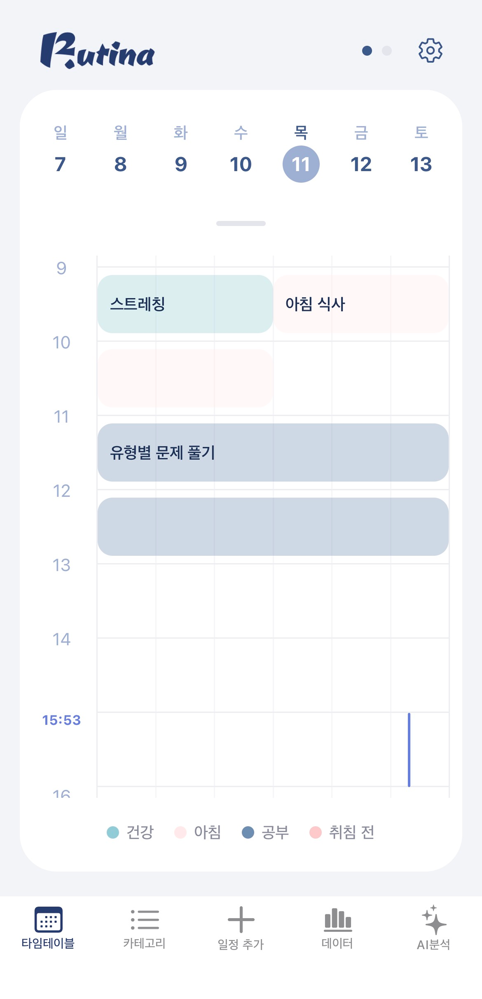
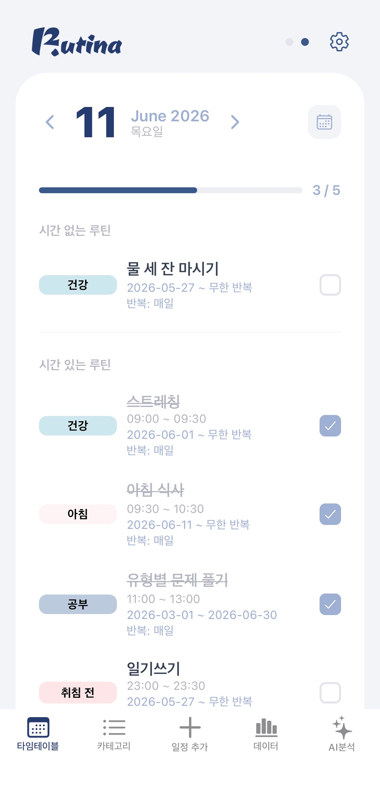
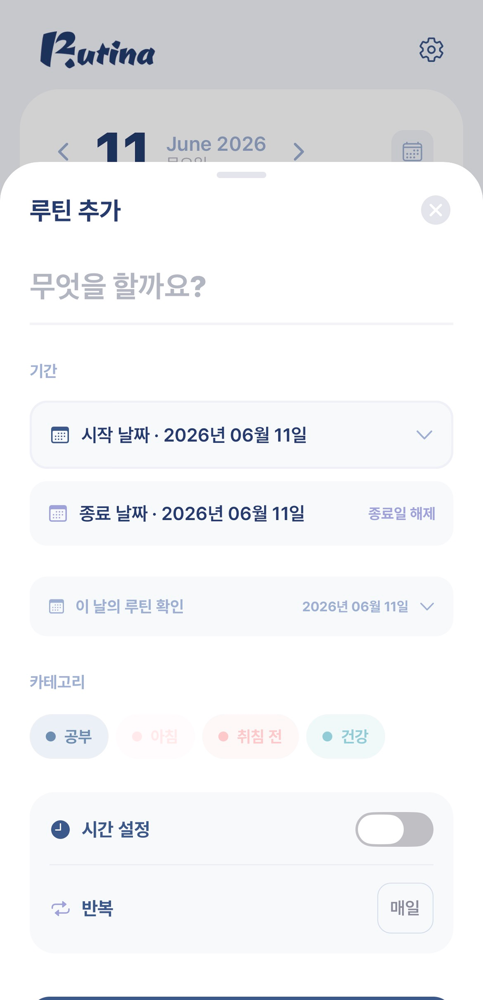
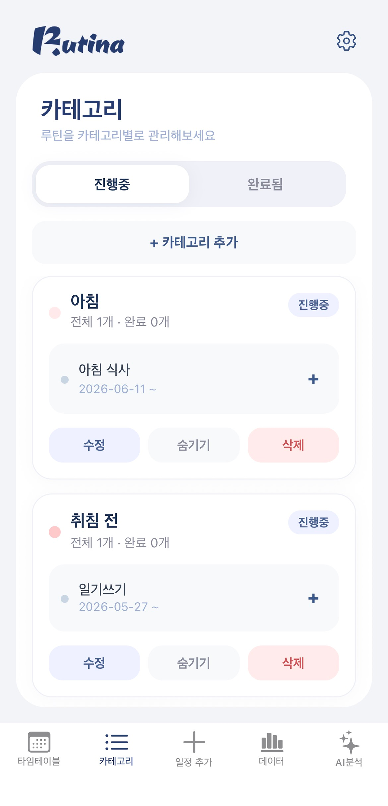
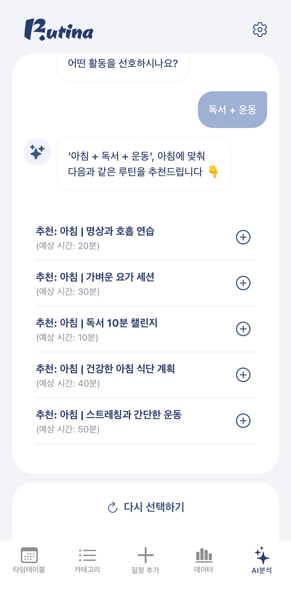
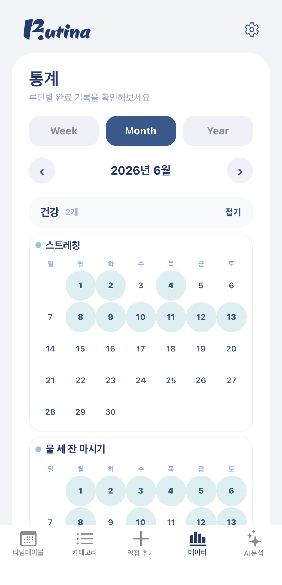

<div align="center">


**루티나(Rutina)** — 하루의 흐름을 타임테이블로 설계하고, AI가 루틴을 추천해주는 루틴 관리 앱

스페인어 _rutina_(루틴)에서 이름을 따온 프로젝트입니다.

<a href="https://apps.apple.com/app/rutina/id6769327521">
  
</a>
&nbsp;
<a href="https://rutina.co.kr/">
  
</a>

> Android 버전은 현재 출시 준비 중입니다.

</div>

---

## 목차

- [소개](#소개)
- [화면](#화면)
- [핵심 기능](#핵심-기능)
- [기술 스택](#기술-스택)
- [화면 구성](#화면-구성)
- [로컬 실행](#로컬-실행)
- [빌드 & 배포](#빌드--배포)
- [팀 소개](#팀-소개)

---

## 소개

Rutina는 사용자가 하루 루틴을 **시간대 기반 타임테이블**로 관리하고, 누적된 실천 기록을 **히트맵**으로 돌아보며, **AI 추천**으로 새로운 루틴을 발견할 수 있도록 돕는 모바일 앱입니다.

이 저장소는 Rutina의 **모바일 앱(프론트엔드)** 입니다. Expo + React Native로 iOS와 Android를 함께 지원합니다.

- **공식 사이트**: https://rutina.co.kr/
- **App Store**: 출시 완료 (위 배지 링크)

---

## 화면

|                          메인 타임테이블                          |                              루틴 목록                               |                              루틴 추가                              |
| :---------------------------------------------------------------: | :------------------------------------------------------------------: | :-----------------------------------------------------------------: |
|  |  |  |

|                             카테고리                             |                          AI 추천                           |                             히트맵                              |
| :--------------------------------------------------------------: | :--------------------------------------------------------: | :-------------------------------------------------------------: |
|  |  |  |

---

## 핵심 기능

- **타임테이블 뷰** — 하루를 시간대로 나누어 루틴을 배치하고 한눈에 흐름을 파악합니다.
- **AI 루틴 추천** — 사용자 맥락에 맞는 루틴을 추천받고 바로 내 루틴에 추가합니다.
- **히트맵 시각화** — 주/월/년 단위로 루틴 실천 기록을 시각적으로 돌아봅니다.
- **소셜 로그인** — Kakao · Naver · Google · Apple 로그인 지원.
- **로컬 푸시 알림** — 루틴 시간에 맞춰 기기 알림을 전송합니다.
- **온보딩 튜토리얼** — 첫 사용자를 위한 가이드 흐름.

---

## 기술 스택

| 구분         | 기술                                                                          |
| ------------ | ----------------------------------------------------------------------------- |
| Framework    | Expo (SDK 54), React Native 0.81, React 19                                    |
| Routing      | Expo Router                                                                   |
| State        | Zustand                                                                       |
| Auth         | expo-auth-session, expo-apple-authentication, expo-web-browser                |
| Storage      | AsyncStorage                                                                  |
| Notification | expo-notifications                                                            |
| HTTP         | Axios                                                                         |
| UI           | react-native-calendars, reanimated, lucide-react-native, react-native-webview |
| Build        | EAS Build                                                                     |

---

## 화면 구성

```
app/
├─ onboarding/       로그인, 회원가입, 약관, 비밀번호 재설정, 튜토리얼
├─ (tabs)/           메인(index), 추가(add), 카테고리, 데이터(히트맵), AI 분석
└─ settings/         설정, 프로필, 공지, 문의
```

API 베이스 URL은 `https://rutina.co.kr` 의 백엔드 서버를 사용합니다.

---

## 로컬 실행

### 요구 사항

- Node.js LTS
- Expo Dev Client (네이티브 모듈을 사용하므로 Expo Go 대신 Dev Client 빌드 필요)

### 실행

```bash
# 저장소 클론
git clone https://github.com/induk-capstone-team/rutina-frontend.git
cd rutina-frontend

# 의존성 설치
npm install

# 개발 서버 실행
npm start

# 플랫폼별 실행
npm run ios
npm run android
```

> OAuth2 소셜 로그인과 로컬 푸시 알림은 네이티브 기능이므로, `expo-dev-client`로 빌드한 개발 클라이언트에서 실행해야 정상 동작합니다.

---

## 빌드 & 배포

EAS Build로 빌드하고 App Store에 배포합니다.

```bash
# 프로덕션 빌드
eas build --platform ios --profile production

# 스토어 제출
eas submit --platform ios
```

- **iOS Bundle ID**: `com.rutina.app`
- **Android Package**: `com.rutina.app` (출시 준비 중)
- **딥링크 스킴**: `rutinafrontend`

---

## 팀 소개

| 이름   | 역할     | GitHub                                     |
| ------ | -------- | ------------------------------------------ |
| 차부곤 | Frontend | [@Dev-Combu](https://github.com/Dev-Combu) |
| 김다현 | Frontend | [@kimmmddh](https://github.com/kimmmddh)   |
| 송지현 | Backend  | [@Jihyeonnn](https://github.com/Jihyeonnn) |
| 이성원 | Backend  | [@swon0913](https://github.com/swon0913)   |
| 김도현 | Backend  | [@dodo5517](https://github.com/dodo5517)   |

---

<div align="center">

**Rutina** · [rutina.co.kr](https://rutina.co.kr/) · `official@rutina.co.kr`

</div>
